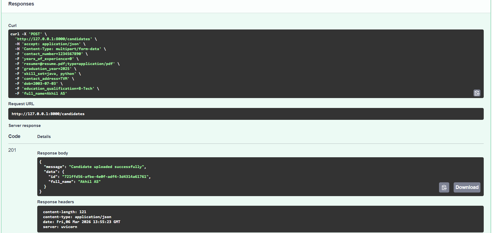
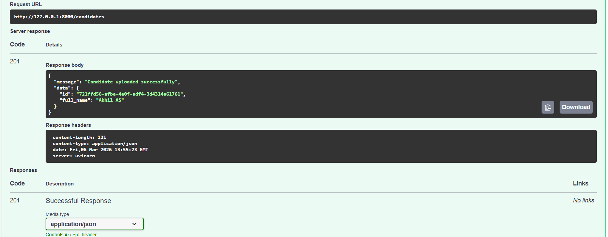
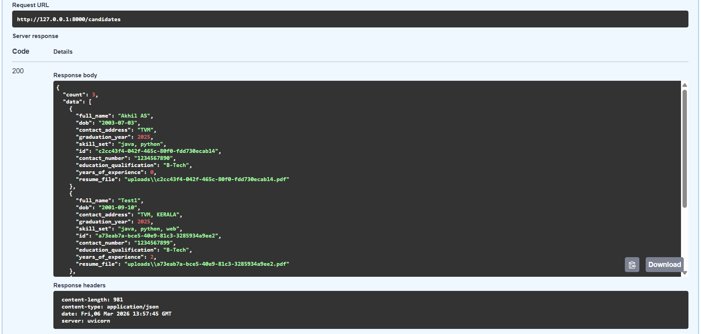

# Mini Resume Management API

#### Built using FastApi that allows uploading resume, storing candidate data and filtering.

### Technologies Used
Python 3.14.0
FastApi
Uvicorn
Python-multipart

## Installation Steps
### Clone Repository
#### git clone https://github.com/akhil0-7/miniresume-akhil-as
#### cd miniresume-akhil-as

### Install Dependencies
pip install -r requirements.txt

### Steps to run the App
uvicorn main:app --reload
#### App will start at - http://127.0.0.1:8000

#### Swagger UI - http://127.0.0.1:8000/docs

## Example API Request/Response

### POST /candidates (request)

### POST /candidates (response)

### GET /candidates
